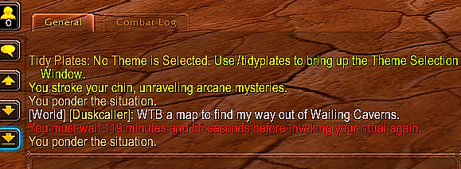

# 🧙‍♂️ Eluna Script: Class Emote Buffs

This Eluna Lua script allows players on an **AzerothCore 3.3.5 WoW server** to cast unique, immersive buffs by performing a class-specific `/emote`. These buffs are thematic, randomized, and restricted by a cooldown to prevent spam.

---

## 🔧 Features

- 🎭 **Class-Based Emote Triggers**  
  Each class has a custom emote that triggers a buff ritual.

- 🧪 **Random Buff Selection**  
  One of three buffs is chosen at random for the player.

- ⏳ **Cooldown System**  
  2-hour (7200 second) cooldown per character.

- 💬 **Immersive Flavor Text**  
  Players receive a class-specific description message when buffed.

---

## 📜 Script Overview

```lua
print("[Eluna] Class Emote Buffs loaded")

local PLAYER_EVENT_ON_TEXT_EMOTE = 24
local COOLDOWN_SECONDS = 7200  -- 2 hours cooldown
local cooldowns = {}

-- Class-based configuration
local classConfig = {
    [1] = { -- Warrior
        emote = 136, -- /taunt
        buffs = {23735, 23737, 23767},
        message = "You taunt your enemies, daring them to try their luck."
    },
    [2] = { -- Paladin
        emote = 78, -- /salute
        buffs = {23767, 23735, 23738},
        message = "You raise your hand in salute, a beacon of righteous order."
    },
    [3] = { -- Hunter
        emote = 44, -- /gaze
        buffs = {23736, 23769, 23768},
        message = "You scan the horizon, locking eyes with your next prey."
    },
    [4] = { -- Rogue
        emote = 131, -- /smirk
        buffs = {23736, 23735, 23768},
        message = "You smirk knowingly. They never saw you coming."
    },
    [5] = { -- Priest
        emote = 74, -- /pray
        buffs = {23738, 23766, 23769},
        message = "You kneel and murmur a forgotten prayer, feeling your deity’s gaze linger upon you for but a moment."
    },
    [6] = { -- Death Knight
        emote = 98, -- /threat
        buffs = {23735, 23737, 23767},
        message = "You dare challenge the power of the Scourge?"
    },
    [7] = { -- Shaman
        emote = 407, -- /mutter
        buffs = {23769, 23738, 23766},
        message = "You mutter an invocation to the elemental spirits."
    },
    [8] = { -- Mage
        emote = 120, -- /ponder
        buffs = {23766, 23738, 23768},
        message = "You stroke your chin, unraveling arcane mysteries."
    },
    [9] = { -- Warlock
        emote = 20, -- /cackle
        buffs = {23768, 23766, 23769},
        message = "You cackle madly as shadow energies gather around you."
    },
    [11] = { -- Druid
        emote = 75, -- /roar
        buffs = {23738, 23736, 23737},
        message = "You let out a primal roar, channeling the wilds within."
    }
}

local function OnClassPrayer(event, player, textEmote, emoteNum, guid)
    local classId = player:GetClass()
    local config = classConfig[classId]
    if not config then return end

    if textEmote ~= config.emote then return end

    local guid = player:GetGUIDLow()
    local now = os.time()
    local last = cooldowns[guid] or 0

    if now - last < COOLDOWN_SECONDS then
        local remaining = COOLDOWN_SECONDS - (now - last)
        local mins = math.floor(remaining / 60)
        local secs = remaining % 60
        player:SendBroadcastMessage(string.format("|cffff0000You must wait %d minutes and %d seconds before invoking your ritual again.", mins, secs))
        return
    end

    cooldowns[guid] = now

    local buffId = config.buffs[math.random(1, #config.buffs)]
    player:AddAura(buffId, player)
    player:SendBroadcastMessage(config.message)
end

RegisterPlayerEvent(PLAYER_EVENT_ON_TEXT_EMOTE, OnClassPrayer)
```

---

## 💬 Emote Reference by Class

| Class         | Emote       | ID   | Flavor Text |
|---------------|-------------|------|--------------|
| Death Knight  | `/threat`   | 98   | "You dare challenge the power of the Scourge?" |
| Druid         | `/roar`     | 75   | "You let out a primal roar, channeling the wilds within." |
| Hunter        | `/gaze`     | 44   | "You scan the horizon, locking eyes with your next prey." |
| Mage          | `/ponder`   | 120  | "You stroke your chin, unraveling arcane mysteries." |
| Paladin       | `/salute`   | 78   | "You raise your hand in salute, a beacon of righteous order." |
| Priest        | `/pray`     | 74   | "You kneel and murmur a forgotten prayer..." |
| Rogue         | `/smirk`    | 131  | "You smirk knowingly. They never saw you coming." |
| Shaman        | `/mutter`   | 407  | "You mutter an invocation to the elemental spirits." |
| Warlock       | `/cackle`   | 20   | "You cackle madly as shadow energies gather around you." |
| Warrior       | `/taunt`    | 136  | "You taunt your enemies, daring them to try their luck." |

---

## 🎯 Buff Spell IDs

| Spell ID | Effect        |
|----------|---------------|
| 23735    | Strength      |
| 23736    | Agility       |
| 23737    | Stamina       |
| 23738    | Spirit        |
| 23766    | Intelligence  |
| 23767    | Armor         |
| 23768    | Damage Boost  |
| 23769    | Resistance    |

---

## 🏁 Usage Example

1. You are a Mage.
2. Type `/ponder` in chat.
3. You receive one of your class's buffs and the message:
   ```
   You stroke your chin, unraveling arcane mysteries.
   ```
4. If you try again before the cooldown ends, you get:
   ```
   You must wait X minutes and XX seconds before invoking your ritual again.
   ```
Where X is the amount of time before you can get the buff again.



---

## 🧪 Installation Instructions

1. Place this `.lua` file in your `lua_scripts/` directory.
2. Restart your `worldserver`.
3. Players can now use their emotes to receive buffs based on class.

---

## ✅ Optional Enhancements

- Add visual spell animations or sounds.
- Send messages to nearby players (for roleplay events).
- Add race-specific flair or conditions.
- Sync with your in-game Guild Commands addon.

---

## 💬 Feedback

Feel free to fork, extend, or suggest improvements!
